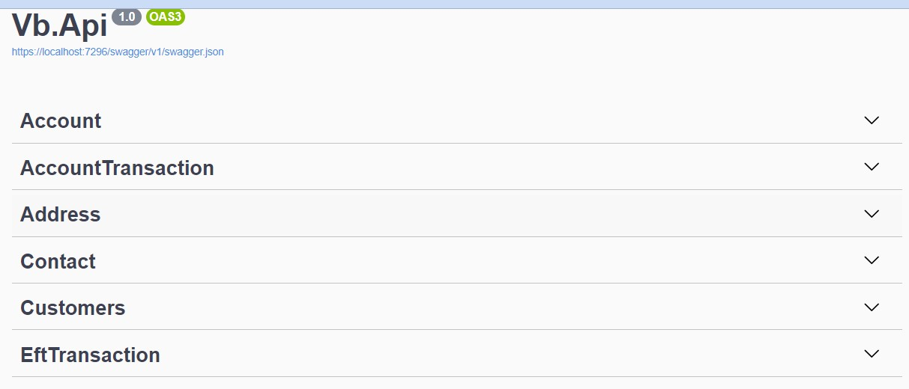
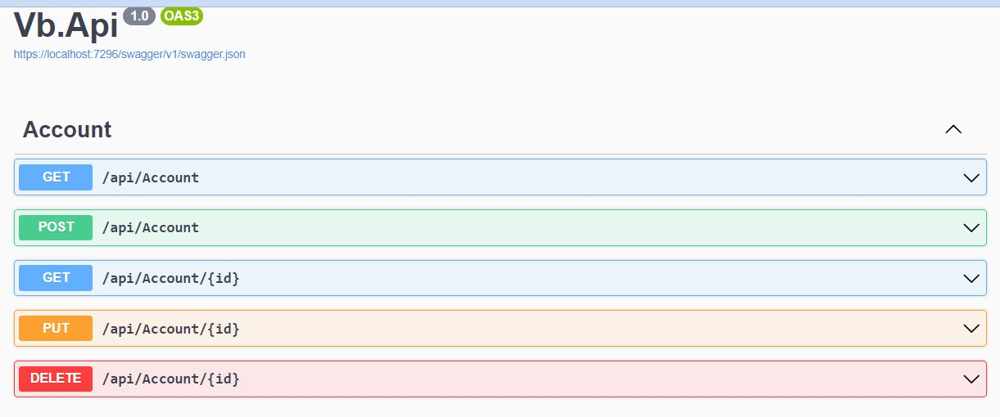
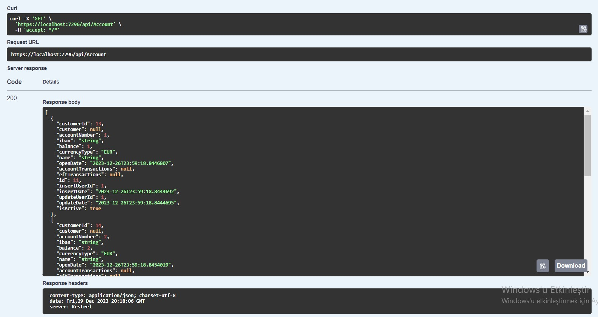

[](https://classroom.github.com/a/GfoSvSyx)

# Akbank .Net Bootcamp Ödevi
Akbank ve patikadev tarafından gerçekleştirilen Asp.Net eğitimi sürecinde verilen ilkinci ödev. Bu projede bizden canlı dersimiz esnasında oluşturulan modeller icin Controller larin GET GETbyId PUT POST DELETE methodlari olacak hazirlanmasi olacak.

[Akbank .Net Bootcamp Ödev 1](https://github.com/300-Akbank-Net-Bootcamp/aw-1-ysfArslan1)

## Controller oluşturulması :
Canlı ders sırasında oluşturulan controller'lar oluşturuldu ve istenilen metotlar eklendi. 






## Proje Yapısı ve Kod Blokları:
- proje farklı katmanlardan oluşmaktasır. Api katmanı wep api dosyalarının bulundugu katman. Base katmanı projede temel olarak kullanılan dosyaların bulundugu katman. Bussiness katmanı şuan kullanılmasada validation ve automapping işlemlerinin gerçekleşecegi katman. Data katmanı Database baglantısının yapıldıgı ve Database ile ilgili dosyaların bulundugu katman.

- Projede Database olarak microsoft sql server kullanıldı . Migration eklemek için kullanılan komut:
    ```
        dotnet ef migrations add mig1 --project Vb.Data --startup-project Vb.Api
    ```
-  Eklenen Migrationların uygulanması için kullanılan komut:
    ```
           dotnet ef database update --project "./Vb.Data" --startup-project "./Vb.Api"
    ```

    


